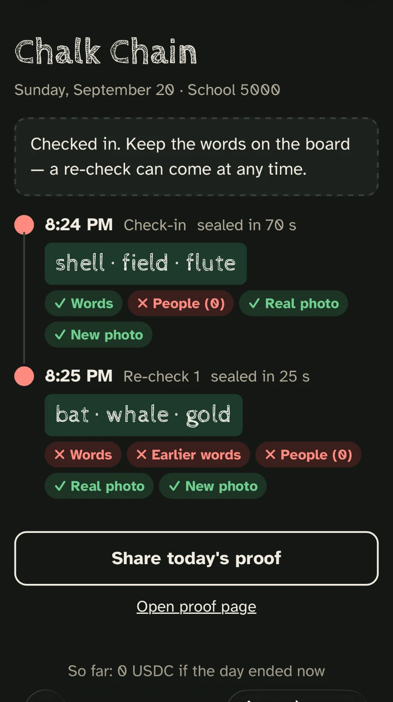
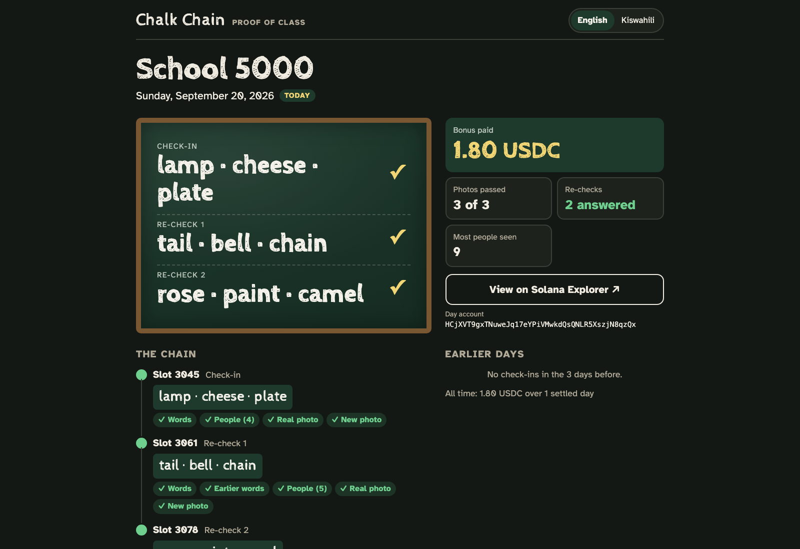

# Chalk Chain

Teachers chalk 3 words derived from a live Solana slot hash on the board and photograph the class.
A Solana program only accepts the photo's hash if it was committed within ~150 s of those words existing,
and surprise re-checks extend a chain of words on the board. A vision service checks each photo, an oracle
attests the result on-chain, and the program pays a USDC bonus per passing photo at the end of the day.

`SPEC.md` is the contract between the parts (byte layouts, account order, error codes, HTTP routes).

## Screenshots

| The teacher's day, on a phone | The public proof page |
| --- | --- |
|  |  |
| A real run against a real whiteboard. The first photo's words were read correctly; the second board was deliberately written wrong, and every check that should fail does. | Anyone can open this for a teacher and day. No key, no wallet: the words, which checks passed, the payout, and a link to the day's account on Solana Explorer. |

More in [`media/`](media/), including the graphics used in the pitch.

## Architecture

```
   teacher's phone (PWA, app/)                           Solana (program/, Anchor 1.1.2)
 ┌─────────────────────────────┐                      ┌───────────────────────────────────┐
 │ teacher key (IndexedDB)     │                      │ chalk_chain                       │
 │ words = sha256(slot_hash ‖  │  GET /slot, /day     │  Config · Teacher · Day PDAs      │
 │   teacher ‖ prev)[0..3]     │◀──────────┐          │  check_in / recheck_in:           │
 │ photo → sha256 → check_in   │           │          │    now - slot ≤ window_slots,     │
 │ tx signed by teacher,       │ POST /relay (tx)     │    slot hash read from SlotHashes │
 │ fee payer = relayer         │──────────┐│          │  attest (oracle) · settle_day     │
 └──────────────┬──────────────┘          ││          │  roll_recheck (anyone)            │
                │ POST /verify (photo)    ▼│          └──────────────▲────────────────────┘
                │               ┌──────────┴──────────┐              │
                └──────────────▶│ backend/ (Hono)     │──────────────┘
                                │ relayer: co-signs   │  RPC (Kit): send tx, read accounts,
                                │   allow-listed txs  │  read SlotHashes sysvar
                                │ oracle: attest,     │
                                │   recheck, settle   │   POST /verify (multipart)
                                │ admin CLI           │─────────────────────────┐
                                └─────────────────────┘                         ▼
                                                                  ┌──────────────────────────┐
         shared/: word lists, derivation vectors,                 │ vision/ (FastAPI)        │
         @chalk/shared TS codec (PDAs, builders,                  │ words on board (Claude   │
         decoders, errors), IDL, deploy.json                      │   or mock), headcount,   │
                                                                  │ moire recapture, PDQ     │
                                                                  │   reuse index            │
                                                                  └──────────────────────────┘
```

Flow for one day: register → check_in (link 0) → /verify → attest. A re-check starts from the demo
button (`/recheck`) or from an unpredictable roll at boundary slots (`/roll`). Then recheck_in (link k,
chained from link k-1's commit) → /verify → attest. Finally /settle pays `passing × bonus_per_link`
USDC, or 0 if link 0 failed or a re-check was missed.

## Directory map

| Path | What | Owner |
|---|---|---|
| `program/` | Anchor program `chalk_chain` (9 instructions, SPEC §2) | P1 chain + backend |
| `backend/` | Hono server :8787: relayer, oracle, admin CLI (SPEC §4) | P1 |
| `app/` | React PWA for teachers (Vite, :5173) | P2 app |
| `vision/` | FastAPI :8001 photo checks (SPEC §3) | P3 vision |
| `shared/` | word lists, vectors, `@chalk/shared` TS package, `idl/`, `deploy.json` | P1/P2 |
| `scripts/` | setup, dev, stop, e2e | integration |
| `SPEC.md`, pitch, demo script | the story | P4 story |
| `keys/` | admin / relayer / oracle keypairs (gitignored, created by `admin keygen`) | – |

## Quickstart (localnet)

Needs the toolchain in `SPEC.md` (Solana CLI 3.1.10, Anchor 1.1.2, Node 24, pnpm 10, Python 3.14).
The scripts put `~/.local/share/solana/...`, `~/.cargo/bin`, `~/.avm/bin` and Node 24 on PATH themselves.

```sh
pnpm install
(cd vision && python3 -m venv .venv && .venv/bin/pip install -r requirements.txt)   # once

scripts/setup-localnet.sh     # validator + build + deploy + keys + mock USDC + config + 1000 USDC vault (~20 s)
scripts/dev.sh                # vision :8001, backend :8787, app :5173 (Ctrl-C stops them)
open http://localhost:5173
```

- `scripts/dev.sh --bg` runs in the background with logs in `.run/*.log`; `scripts/stop.sh` stops the
  services and the validator, and `scripts/stop.sh dev` stops only the services.
- `pnpm e2e` runs the full loop against the running stack (`scripts/dev.sh --bg --no-app` is enough).
  It registers teachers, checks in, verifies, runs a re-check, settles, and checks the USDC balance.
  It also checks SlotTooOld, cross-teacher photo reuse, the relay refusing a foreign program or a
  relayer drain, and roll_recheck. On a fresh chain it waits about 90 s for a stale slot to exist.
- `pnpm test:all` runs every unit suite (shared, backend, app, app build, vision, program).
- Localnet uses **solana-test-validator**, not Surfpool: check_in reads the real `SlotHashes` sysvar,
  which must advance every slot.

**Phone testing.** The camera and WebCrypto need HTTPS:

```sh
VITE_HTTPS=1 scripts/dev.sh     # then open https://<laptop-LAN-ip>:5173 on the phone and accept the cert
```

The phone only talks to the Vite server. `/api/*` is proxied to the backend on the laptop, so there's
no mixed content and no "localhost is the phone" problem.

**Demo tips.** The Home screen's *Demo panel* shows the program, relayer, teacher and slot. It has
*Trigger re-check* (instant, oracle-signed), *Roll for re-check* (the unpredictable path; needs a
boundary slot after the last photo), a language toggle, and *Reset teacher*. *End school day* (tap
twice) settles and shows the USDC paid. After re-running `setup-localnet.sh` the app notices that its
teacher is no longer registered and shows Setup again.

## Surprise re-checks (auto)

With `CHALK_AUTO_ROLL=1` (or `scripts/dev.sh --auto-roll`) the backend cranks `roll_recheck` by itself,
so re-checks show up without anyone pressing *Roll for re-check*. It is off by default so `pnpm e2e`
stays deterministic; leave it off when running the e2e.

- It watches every (teacher, day) whose check_in or recheck_in went through `/relay`. After a backend
  restart that list is empty; `POST /watch {teacher, day}` adds a day back (404 if there is no check-in).
- Every `CHALK_AUTO_ROLL_MS` (default 3000) it rolls each open day at the newest boundary slot after
  the last photo. It skips days with a re-check already open, never rolls the same boundary twice, and
  forgets days that are settled, have a full chain, or are older than yesterday.
- Each roll is logged with hit/miss in `.run/backend.log`. `GET /health` shows
  `autoRoll: {enabled, intervalMs, active, lastRoll}`.

With the default config a boundary comes every ~2 min and hits 1 time in 4. For a demo, make them
frequent (about every 20 s, half of them hits) and put it back afterwards:

```sh
pnpm --filter backend admin update-config --recheck-interval-slots 50 --recheck-threshold 128
CHALK_AUTO_ROLL=1 scripts/dev.sh
pnpm --filter backend admin status            # current values; restore with update-config later
```

The teacher then has `recheck_window_slots` (~3 min) from the boundary slot to send the new photo.

**Rate limits.** POST routes are limited per client IP (token bucket, requests per minute): `/relay` 30,
`/verify` 20, `/roll` 60 (the e2e polls it while waiting for a boundary), `/recheck`, `/settle` and
`/watch` 10. Over the limit the backend answers 429 `Too many requests — wait a moment and try again.`
with `Retry-After`. `CHALK_RATE_LIMIT=0` turns them off. Requests through the Vite `/api` proxy all come
from 127.0.0.1, so phones using the proxy share one bucket unless the proxy sends `X-Forwarded-For`.

## Devnet

```sh
scripts/setup-devnet.sh        # builds, reuses keys/, prints balances; exits early and tells you what to fund
# fund admin (~3 SOL), relayer (~0.5), oracle (~0.3) via https://faucet.solana.com, then run it again
scripts/dev.sh
```

It writes `shared/deploy.json` with `cluster: devnet`, which replaces the localnet config. Run
`setup-localnet.sh` again to switch back. Re-runs upgrade the program in place and keep the mint.
The "USDC" is a 6-decimal mint whose authority is `keys/admin.json`, not Circle's devnet USDC.

## Environment variables

| Var | Used by | Default / meaning |
|---|---|---|
| `ANTHROPIC_API_KEY` | vision | when set, Claude can read the board; put it in the gitignored `.env` (see `.env.example`) |
| `OPENAI_API_KEY` | vision | when set, OpenAI can read the board; with both keys set, the second provider is the backup |
| `GEMINI_API_KEY` | vision | free-tier Gemini key (aistudio.google.com); `CHALK_GEMINI_MODEL`, default `gemini-3.8-flash` |
| `CHALK_OLLAMA_MODEL` | vision | local model served by Ollama, free and offline (e.g. `qwen2.5vl:7b` after `ollama pull qwen2.5vl:7b`) |
| `CHALK_VISION_PROVIDER` | vision | `claude`, `openai`, `gemini` or `ollama`: which engine goes first; the others (if enabled) are backups, in that order |
| `CHALK_VLM_MODEL` | vision | `claude-opus-5` |
| `CHALK_OPENAI_MODEL` | vision | `gpt-5.5` (`CHALK_OPENAI_EFFORT`, default `low`; set it empty for non-reasoning models) |
| `CHALK_VISION_MODE` | vision | `auto` (models if any are configured, else mock) or `mock`. `dev.sh` defaults to `mock` when none are configured. `pnpm e2e` needs `mock` (it checks) |
| `CHALK_VISION_FALLBACK` | vision | `mock` = if every model errors, answer with the mock instead of 502 (demo safety net) |
| `CHALK_MOCK_HEADCOUNT` | vision | people count the mock reports (7) |
| `CHALK_REUSE_THRESHOLD` | vision | PDQ Hamming distance counted as reuse (31) |
| `CHALK_REUSE_DB` | vision | reuse index file (`vision/data/reuse.json`; delete it to forget old photos) |
| `PORT`, `HOST` | backend | 8787, 0.0.0.0 |
| `CHALK_AUTO_ROLL` | backend, dev.sh | `1` = crank `roll_recheck` automatically (off) |
| `CHALK_AUTO_ROLL_MS` | backend | cranker poll interval in ms (3000) |
| `CHALK_RATE_LIMIT` | backend | `0` = no per-IP limits on POST routes (on) |
| `VISION_URL` | backend | `http://127.0.0.1:8001` |
| `CHALK_DEPLOY`, `CHALK_KEYS_DIR`, `CHALK_RPC_URL` | backend, scripts | `shared/deploy.json`, `keys/`, RPC override |
| `VITE_BACKEND_URL` | app | absolute backend URL instead of the `/api` proxy |
| `BACKEND_PROXY_TARGET` | app | where Vite proxies `/api` (`http://localhost:8787`) |
| `VITE_HTTPS` | app | `1` = self-signed HTTPS for phones |
| `SKIP_BUILD` | setup scripts | `1` = reuse `program/target/deploy/chalk_chain.so` |
| `WINDOW_SLOTS`, `RECHECK_WINDOW_SLOTS`, `RECHECK_INTERVAL_SLOTS`, `BONUS_PER_LINK`, `MIN_HEADCOUNT` | setup-localnet | init-config overrides |

## Troubleshooting

- **"Photo sent too late" (SlotTooOld, 6001).** The photo must land within `window_slots` of the
  challenge slot (default 150 s ÷ measured slot time, about 330 slots at 450 ms, capped at 450 slots
  because SlotHashes only keeps 512). For a slow demo, widen it:
  `pnpm --filter backend admin update-config --window-slots 400`. Check the current values with `admin status`.
- **Slot time.** Measured from `getRecentPerformanceSamples` (slots per wall-clock second), falling
  back to watching `getSlot` for 2 s on a chain younger than one sample period. Do NOT use
  `getBlockTime`: solana-test-validator estimates a flat 1 s per slot while really producing one
  every ~470 ms, which made the app show a window twice as long as the program allowed.
- **Re-check never rolls.** `/roll` returns 409 with `nextBoundary` until a multiple of
  `recheck_interval_slots` has passed after the last photo. For demos, use *Trigger re-check*, or run
  `admin update-config --recheck-interval-slots 20 --recheck-threshold 255`. To have them happen on
  their own, see *Surprise re-checks (auto)*.
- **429 "Too many requests".** A per-IP rate limit; wait a few seconds, or start the backend with
  `CHALK_RATE_LIMIT=0`.
- **Devnet faucet limits.** `solana airdrop` is rate-limited and often fails. Use faucet.solana.com
  (GitHub login) or transfer from a funded wallet. The relayer pays about 0.007 SOL of rent per
  teacher-day.
- **Port busy.** `scripts/stop.sh`. If 8899 is taken by Surfpool or another validator, stop it first.
- **"New photo" fails on a legit photo.** The reuse index persists in `vision/data/reuse.json` across
  runs. Delete it after demos. Photos from the same teacher and day are never compared.
- **App stuck on an old teacher.** Use *Reset teacher* in the Demo panel, or clear site data.
